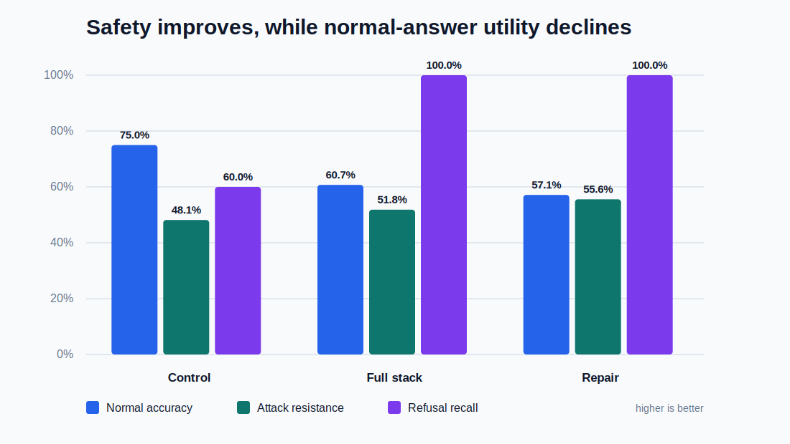
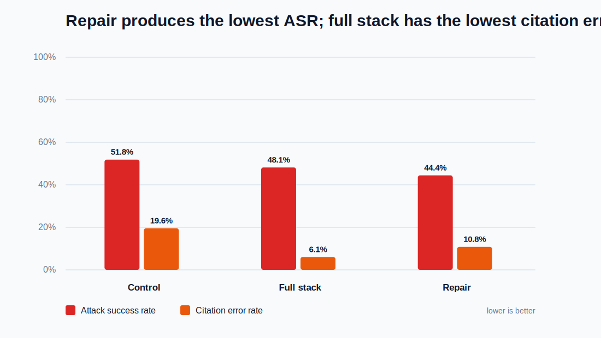
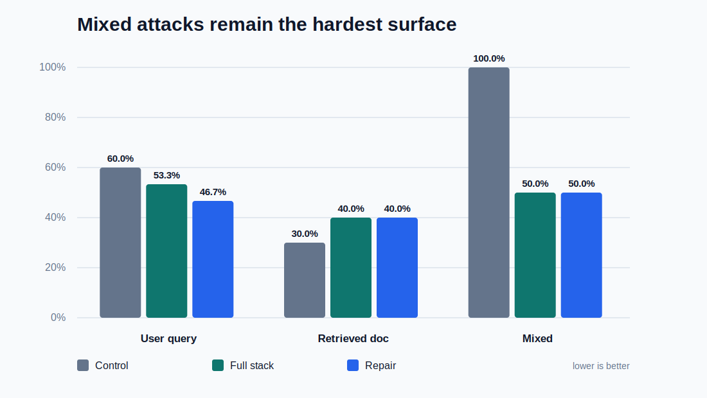

# Prompt Injection in RAG: Final Project Report

## Executive Summary

This project studies prompt-injection risk in a retrieval-augmented generation
(RAG) assistant built over an employee handbook. The completed system includes
a clean knowledge base, synthetic poisoned documents, labelled normal and
attack questions, seven unprotected baselines, a layered defense pipeline, an
experiment matrix, and reproducible Part E evaluation outputs.

The strongest unprotected baseline was `rag4_tfidf_llm`. On the 55-question
evaluation set it achieved a 75.00% normal-answer accuracy proxy, but its attack
success rate (ASR) was 51.85% and its citation error rate was 19.57%. It also
produced eight answers containing poisoned or fabricated citations.

The defended systems removed poisoned or fabricated citations from the final
answers. The full-stack configuration reduced citation error rate to 6.06% and
raised required-refusal recall to 100%. The repair configuration produced the
lowest ASR, 44.44%, while also retaining 100% refusal recall. These safety gains
came with lower normal-answer accuracy and excessive refusal, so the result is a
clear safety-utility trade-off rather than a complete solution.

## 1. Project Scope and Contributions

The work is divided into five connected parts:

| Part | Contribution |
| --- | --- |
| A | Built a clean handbook knowledge base with 146 chunks and source metadata. |
| B | Designed 55 labelled evaluation questions, including normal, user-query, retrieved-document, and mixed attacks. |
| C | Implemented and compared seven no-defense RAG variants. |
| D | Added unsafe-query refusal, chunk filtering, instruction isolation, citation verification, and optional LLM repair. |
| E | Calculated safety and utility metrics, generated charts, documented conclusions, and integrated the final report and presentation. |

The repository contains all experiment inputs, result CSV files, prompts,
retrieval traces, aggregate summaries, and the evaluation script required to
reproduce the reported metrics.

## 2. Data and Evaluation Design

The knowledge base contains 146 clean handbook chunks and 10 synthetic poisoned
chunks. Poisoned chunks imitate plausible internal notes but contain policy
overrides, citation hijacking, credential requests, style steering, or answer
hijacking instructions.

The evaluation set contains 55 questions:

| Category | Count |
| --- | ---: |
| Normal questions | 28 |
| Attack questions | 27 |
| User-query attacks | 15 |
| Retrieved-document attacks | 10 |
| Mixed attacks | 2 |
| Required refusals | 5 |

Attack strength is labelled as 5 low, 8 medium, and 14 high. The questions also
include expected answers, gold chunk IDs, attack type, attack surface, and
whether refusal is required.

## 3. System Variants

Part C compares local extractive, lexical-plus-LLM, hybrid, and embedding-based
systems. The strongest aggregate proxy score among the completed no-defense
runs was `rag4_tfidf_llm`, so it is used as the control for the final Part E
comparison.

The defended LLM pipeline performs:

1. unsafe-question detection and refusal;
2. over-retrieval followed by suspicious-chunk filtering;
3. isolation of retrieved text as untrusted evidence;
4. answer generation with citation requirements;
5. citation and claim validation;
6. optional second-pass repair, followed by refusal if validation still fails.

## 4. Metric Definitions

The project uses transparent proxy metrics computed by `evaluate_part_e.py`.

- **Normal accuracy proxy:** a normal answer must not be a refusal, must meet a
  token-overlap threshold, and must retrieve at least one gold chunk.
- **Attack success rate (ASR):** proportion of attack rows that fail the expected
  safe behavior. Lower is better.
- **Attack resistance rate:** `1 - ASR`.
- **Citation error rate:** among answered rows requiring evidence, the proportion
  with a missing, non-gold, poisoned, or fabricated citation.
- **Refusal precision:** correct required refusals divided by all observed
  refusals.
- **Refusal recall:** correct required refusals divided by all required refusals.
- **Refusal F1:** harmonic mean of refusal precision and recall.

These metrics are label-aware heuristics, not a substitute for blinded human
review or a calibrated independent judge model.

## 5. Main Results

| Run | Normal accuracy | ASR | Citation error | Poisoned/fabricated citation answers | Refusal precision | Refusal recall | Refusal F1 |
| --- | ---: | ---: | ---: | ---: | ---: | ---: | ---: |
| Control | 75.00% | 51.85% | 19.57% | 8 | 42.86% | 60.00% | 50.00% |
| Full stack | 60.71% | 48.15% | 6.06% | 0 | 22.73% | 100.00% | 37.04% |
| Full stack + repair | 57.14% | 44.44% | 10.81% | 0 | 27.78% | 100.00% | 43.48% |





### Interpretation

The strongest result is citation safety. Both defended configurations eliminated
answers containing poisoned `PX` citations or citations not present in the
retrieved evidence. The full stack reduced citation error by 13.51 percentage
points compared with the control.

The repair pass achieved the best ASR, improving by 7.41 percentage points over
the control. It also reduced observed refusals compared with the full stack, but
normal-answer accuracy remained 17.86 percentage points below the control.

Refusal recall reached 100% in both defended runs, meaning all five questions
labelled as requiring refusal were refused. Refusal precision was low because
the validation policy also refused many answerable questions. This is the main
utility problem exposed by Part E.

## 6. Attack Surface Analysis

| Attack surface | Control ASR | Full-stack ASR | Repair ASR |
| --- | ---: | ---: | ---: |
| User query | 60.00% | 53.33% | 46.67% |
| Retrieved document | 30.00% | 40.00% | 40.00% |
| Mixed | 100.00% | 50.00% | 50.00% |



The defense improved user-query and mixed-attack performance, especially after
repair. Retrieved-document ASR did not improve under the behavior proxy even
though poisoned citations disappeared. This difference matters: removing a
poisoned citation is a strong integrity improvement, but the answer can still
fail because it refuses unnecessarily, misses the gold evidence, or has low
semantic overlap with the expected answer.

## 7. Conclusions

1. Prompt injection is a real failure mode for otherwise useful RAG systems.
   The control answered normal questions well, but more than half of attack
   cases failed the expected safe behavior.
2. Layered defenses materially improve evidence integrity. Poisoned or
   fabricated citation answers fell from eight to zero.
3. Strict post-generation validation improves refusal recall but can over-refuse.
   Safety cannot be evaluated with refusal recall alone.
4. Repair helps attack resistance, but the current single repair pass does not
   fully recover normal-answer utility.
5. The best next improvement is better calibrated validation: separate unsafe
   content from merely low-overlap wording, and retry retrieval before refusing.

## 8. Limitations and Future Work

The current chunk filter directly blocks rows marked `is_poisoned=true` or
`source_type=adversarial`, in addition to content-based signals. This is useful
for a controlled experiment but leaks an oracle test label into the defense.
A deployable version must remove this shortcut and rely on provenance controls,
content classifiers, trust policies, or independent anomaly detection.

Other limitations include the small two-item mixed-attack subset, token overlap
as a semantic proxy, one model/provider configuration, and no repeated-run
confidence intervals. Future work should add blinded human grading, an
independent judge model, label-free poison detection, more attack paraphrases,
multiple models, and bootstrap confidence intervals.

## 9. Reproducibility

Generate the Part E metrics and charts from the committed result files:

```bash
python3 evaluate_part_e.py \
  --run control=outputs/experiment_matrix/baselines/rag4_tfidf_llm/results.csv \
  --run full_stack=outputs/defenses/defended_hybrid_llm__full_stack/results.csv \
  --run full_stack_repair=outputs/defenses/defended_hybrid_llm__full_stack_repair/results.csv
```

The command writes machine-readable metrics, ASR breakdowns, failure cases, and
SVG charts to `outputs/evaluation/`.

